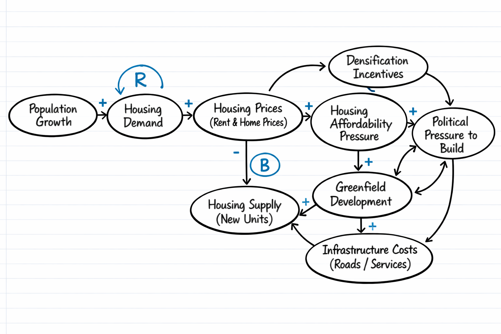
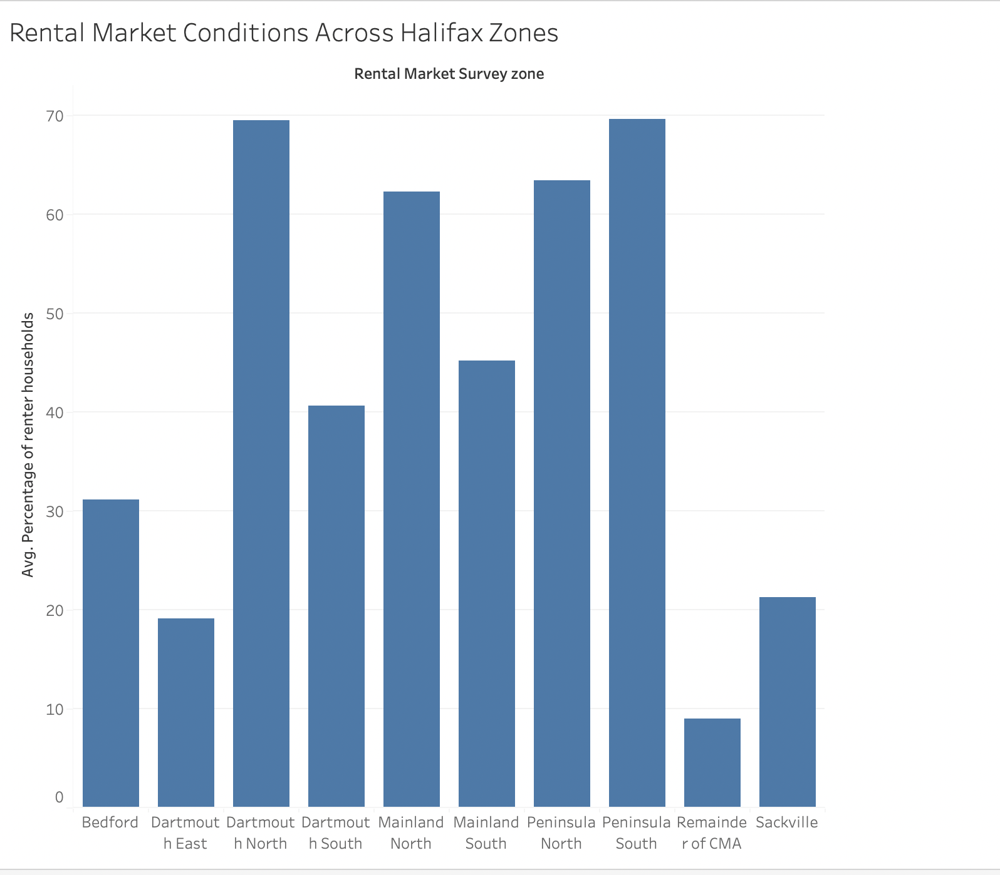
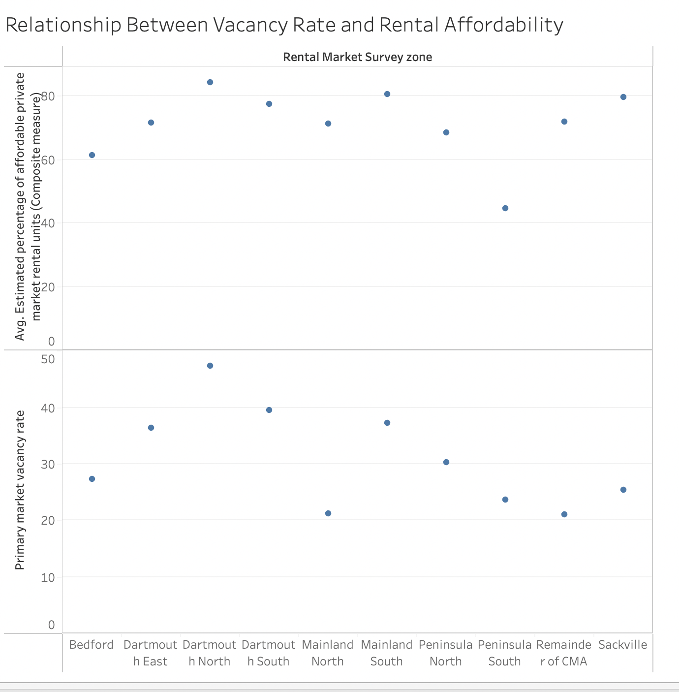
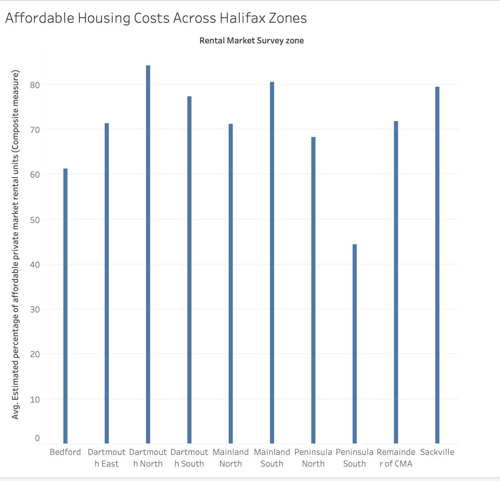
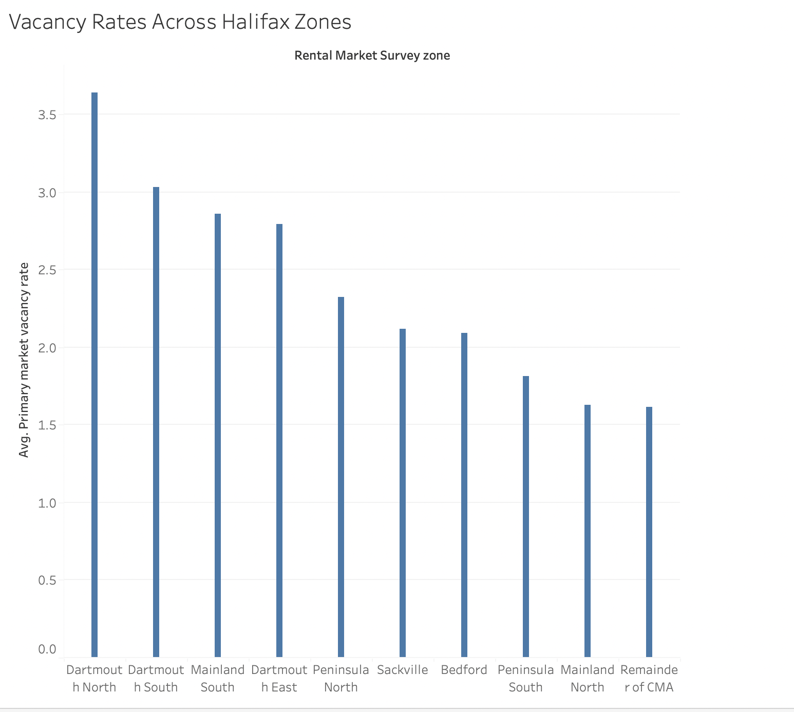
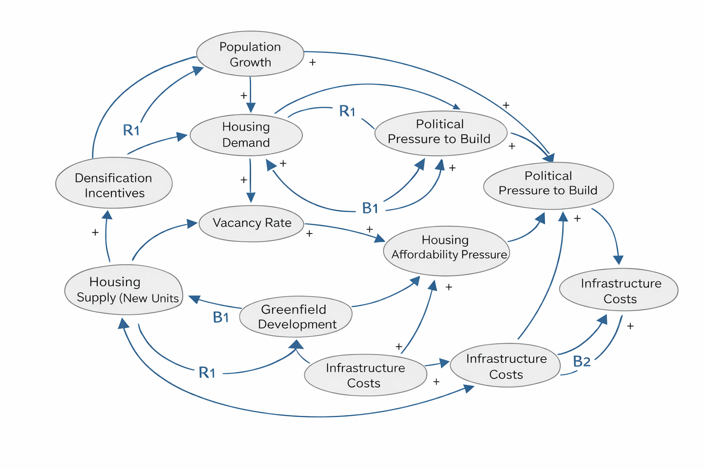
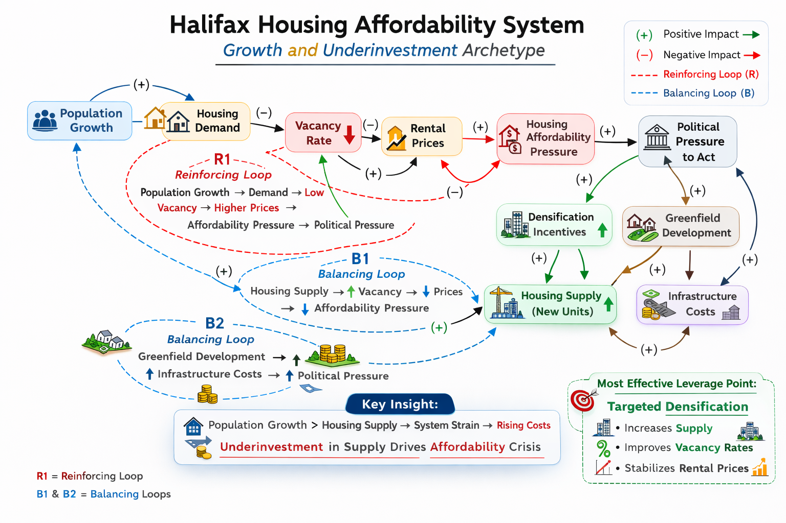

# Balancing Density and Expansion: Housing Affordability in Halifax
Decision-focused term project for BSAD 482 examining housing affordability in Halifax. The project frames a policy choice faced by the municipal planning director between densification incentives and greenfield development, using systems thinking, causal loop diagrams, and public datasets.

> [!WARNING]
> There are others doing this already in the class. There is a requirement to be unique to you.  Consider pivoting to your hometown.

# Balancing Density and Expansion: Housing Supply Decisions in Halifax

## Decision Statement
Should the Halifax Regional Municipality’s planning director prioritize densification incentives or greenfield development to address housing affordability over the next five years?

## Executive Summary
Halifax is experiencing sustained population growth driven by immigration, interprovincial migration, and demographic shifts, placing increasing pressure on its housing market. Rising home prices and rental costs have intensified affordability concerns for residents, while supply struggles to keep pace with demand. The planning director of the Halifax Regional Municipality (HRM) faces a critical decision: whether to prioritize densification within existing urban areas or continue expanding housing supply through greenfield development on the city’s outskirts.

This decision is complex due to competing economic, social, and environmental considerations. Densification can increase housing supply more efficiently and leverage existing infrastructure, but it often faces public resistance and zoning constraints. Greenfield development can deliver housing quickly and at lower upfront costs, yet it risks urban sprawl, infrastructure strain, and long-term environmental impacts. Budget limitations, political pressures, and long-term sustainability goals further complicate the choice.

The outcome of this decision will shape housing affordability, transportation patterns, infrastructure costs, and environmental outcomes in Halifax for decades. Framing the issue as a systems-based decision highlights the feedback loops between housing supply, prices, population growth, infrastructure demand, and public acceptance—underscoring why data-informed decision-making is essential.

## Table of Contents
- [Background](#background)
- [Data Sources](#data-sources)
- [Exploratory Findings](#exploratory-findings)
- [Recommendation](#recommendation)
- [Limitations and Future Work](#limitations-and-future-work)
- [References](#references)

https://github.com/haydenoliver88/house-halifax.git

## Milestone 2 — Data Exploration

### Visualization 1: Rental Market Conditions by Zone

This visualization shows the variation in renter household concentration across different areas of Halifax. Areas with a higher percentage of renter households typically experience greater housing demand pressure and are more sensitive to changes in rental prices and availability. This insight is important for the planning director because it helps identify where housing affordability challenges are most concentrated and where densification strategies may be most effective.

### Visualization 2: Vacancy Rate vs Rental Affordability

This visualization examines the relationship between vacancy rates and rental affordability. Lower vacancy rates typically indicate a tighter housing market, which puts upward pressure on rental prices. The relationship shown here helps support the causal link between housing supply constraints and affordability pressure, which is central to the planning director’s decision between densification and greenfield development.

### Visualization 3: Affordable Housing Costs by Zone

This visualization compares estimated affordable housing costs across different areas of Halifax. The variation highlights which regions experience higher affordability pressures. This insight is critical for the planning director, as it helps identify where densification strategies may be most impactful in addressing housing affordability challenges.

### Visualization 4: Vacancy Rates by Zone

This visualization compares vacancy rates across different areas of Halifax. Lower vacancy rates indicate tighter housing markets and greater supply constraints. Identifying zones with particularly low vacancy rates helps the planning director understand where housing shortages are most severe and where targeted development strategies may be necessary.

## Refined Causal Loop Diagram

The refined causal loop diagram expands the housing affordability system in Halifax by incorporating additional variables and feedback loops identified through data analysis.

A key reinforcing loop (R1) shows how population growth increases housing demand, which reduces vacancy rates and drives up rental prices. This increases affordability pressure and leads to greater political pressure to act.

A balancing loop (B1) demonstrates how increasing housing supply through densification or greenfield development can increase vacancy rates and help stabilize rental prices over time.

A second balancing loop (B2) highlights how greenfield development increases infrastructure costs, which can influence political decision-making and limit expansion.

Evidence from the visualizations supports these relationships. Visualization 2 shows a relationship between vacancy rates and affordability metrics, supporting the link between lower vacancy and higher housing costs. Visualizations 1 and 3 highlight spatial differences across zones, reinforcing how housing pressure varies across Halifax.

## Milestone 3 — Analysis

### System Archetype: Growth and Underinvestment

The housing affordability challenge in Halifax reflects a classic “Growth and Underinvestment” system archetype. In this structure, rapid population growth increases demand for housing, but investment in housing supply and supporting infrastructure does not keep pace. As a result, the system approaches capacity limits, leading to worsening outcomes such as rising rental prices and declining affordability.

In the Halifax context, population growth driven by immigration and interprovincial migration increases housing demand. However, delays in development, zoning constraints, and infrastructure limitations restrict the speed at which new housing supply can be added. This creates sustained pressure on vacancy rates, which remain low, and drives up rental prices.

The archetype is reinforced by feedback loops identified in the causal loop diagram. For example, increasing housing demand reduces vacancy rates, which raises rental prices and affordability pressure. This, in turn, creates political pressure to act, but without sufficient investment or timely execution, the system remains constrained.

Evidence from the data supports this pattern. Visualization 2 shows a relationship between low vacancy rates and higher affordability pressures, while Visualizations 1 and 3 highlight spatial differences in housing demand and cost across Halifax. These patterns suggest that the system is operating near its limits and that underinvestment in supply is a key driver of current challenges.

### System Archetype Diagram

This diagram illustrates the “Growth and Underinvestment” dynamic shaping housing affordability in Halifax. As population growth increases housing demand, vacancy rates decline, which drives up rental prices and creates greater affordability pressure. This reinforces political pressure to act, but if investment in housing supply does not keep pace, the system remains constrained. The diagram also shows how policy responses such as densification and greenfield development influence housing supply and vacancy rates through balancing loops. While increasing supply can help stabilize prices over time, delays in development and rising infrastructure costs can limit the effectiveness of these interventions. Overall, the diagram highlights how interconnected feedback loops drive the housing affordability challenge and why targeted densification is the most effective leverage point.

### Scenario Narratives

### Scenario 1: Status Quo (No Major Policy Change)

If the Halifax Regional Municipality continues its current approach without significant policy change, housing affordability pressures are likely to worsen over the next 5–10 years. Population growth will continue to increase housing demand, as shown in the reinforcing loop identified in the causal loop diagram (Population Growth → Housing Demand → Vacancy Rate → Prices).

With limited acceleration in housing supply, vacancy rates will remain low, maintaining upward pressure on rental prices. As affordability declines, more households will face financial strain, increasing overall housing insecurity. This will further amplify political pressure to act, but without structural changes, responses may remain incremental and insufficient.

Spatial disparities across Halifax will likely persist or worsen. As seen in Visualization 1 and Visualization 3, certain zones already experience higher renter concentrations and affordability pressure. These areas will continue to absorb demand, intensifying congestion and strain on existing infrastructure.

In the absence of significant intervention, the system will remain stuck in a reinforcing cycle where demand consistently outpaces supply. While small policy adjustments may temporarily alleviate symptoms, they will not address the underlying imbalance. This scenario suggests that maintaining the status quo is unlikely to produce meaningful improvements in housing affordability.

### Scenario 2: Densification Strategy

If the planning director prioritizes densification incentives, the system may begin to shift toward a more balanced state over the next 5–10 years. Increased density allows for more efficient use of existing land and infrastructure, accelerating the addition of new housing supply in high-demand areas.

As housing supply increases, vacancy rates are expected to rise modestly, which can help stabilize or slow the growth of rental prices. This activates the balancing loop identified in the causal loop diagram (Housing Supply → Vacancy Rate → Prices → Affordability Pressure), reducing overall pressure in the system.

Densification also supports more sustainable urban development by reducing transportation demand and making better use of public services. Areas identified in Visualizations 1 and 3 as having high renter concentrations would particularly benefit from targeted densification, as it directly addresses localized housing shortages.

However, this approach may face resistance from existing residents concerned about neighborhood change, increased congestion, or strain on local infrastructure. Implementation challenges, including zoning reform and approval timelines, may also slow progress.

Overall, densification offers a more effective long-term solution to affordability challenges, but its success depends on consistent policy support and the ability to overcome political and social resistance.

### Scenario 3: Greenfield Development Strategy

If the planning director prioritizes greenfield development, the system will expand outward to accommodate growing housing demand. This approach can increase housing supply relatively quickly by developing new land on the outskirts of Halifax.

In the short term, increased supply may lead to a slight improvement in vacancy rates and moderate pressure on rental prices. However, this strategy introduces new challenges related to infrastructure costs and long-term sustainability. As shown in the causal loop diagram, greenfield development increases infrastructure costs, which can create additional financial pressure on the municipality and influence future decision-making.

Over time, reliance on greenfield development may reinforce patterns of urban sprawl, increasing transportation demand and reducing overall efficiency. While this approach addresses supply constraints in the short term, it does not fully resolve affordability issues, particularly in central areas where demand remains highest.

Visualizations highlighting spatial differences suggest that greenfield development may not effectively target the zones experiencing the greatest affordability pressure. As a result, benefits may be unevenly distributed.

This scenario demonstrates that while greenfield development can contribute to increased supply, it may create new long-term challenges and does not provide as strong a solution to affordability as densification.

### Leverage Point Analysis

The most effective leverage point in this system is increasing housing supply through targeted densification incentives. This intervention directly impacts multiple feedback loops, particularly the balancing loop between housing supply, vacancy rates, and rental prices.

By increasing supply in high-demand areas, densification can improve vacancy rates and reduce upward pressure on housing costs. This makes it a high-impact intervention relative to effort, as it leverages existing infrastructure and land more efficiently than greenfield expansion.

However, this approach may face resistance from local communities and require policy changes such as zoning reform and faster approval processes. Despite these challenges, targeting densification represents the most effective strategy for addressing the root causes of housing affordability pressure in Halifax.

## Implications for the Decision

The analysis highlights that Halifax’s housing system is constrained by a mismatch between rapid population growth and slower increases in housing supply. Evidence from the visualizations and system dynamics suggests that low vacancy rates are closely linked to rising housing costs and affordability pressure.

Among the options considered, densification appears to be the most effective strategy for addressing these challenges. It directly increases housing supply in high-demand areas and activates balancing feedback loops that can stabilize prices over time. In contrast, maintaining the status quo is likely to worsen affordability issues, while greenfield development introduces additional infrastructure costs and may not effectively target areas of highest need.

However, uncertainty remains regarding the speed of implementation and potential resistance to densification policies. External factors such as economic conditions and migration trends may also influence outcomes.

Overall, the analysis suggests that prioritizing densification provides the strongest pathway toward improving housing affordability, while acknowledging the need for careful implementation and ongoing monitoring.

## Milestone 4 - Synthesis & Portfolio

## Recommendation

The Halifax Regional Municipality should prioritize targeted densification incentives as the primary strategy for improving housing affordability over the next five to ten years.

The analysis from this project shows that housing affordability challenges in Halifax are largely driven by sustained population growth and insufficient housing supply. The data visualizations highlight consistently low vacancy rates and rising rental costs across different zones, while the system dynamics analysis shows how these pressures reinforce one another over time. Without meaningful intervention, these trends are likely to continue, further worsening affordability.

Densification is the strongest policy option because it increases housing supply in areas where demand is already highest. This makes it more effective than greenfield development at improving vacancy rates and stabilizing rental prices in the short to medium term. It also allows the municipality to make better use of existing infrastructure, which is important given the financial and logistical challenges associated with expanding outward. In contrast, greenfield development may increase supply but often comes with higher infrastructure costs and slower impact on the areas experiencing the most pressure.

However, this recommendation depends on successful implementation. Densification efforts may face resistance from communities, zoning restrictions, and delays in the approval process. External factors such as construction costs, interest rates, and migration patterns may also influence outcomes. If these constraints significantly limit the pace of development, the effectiveness of densification could be reduced.

To move forward, the municipality should focus on accelerating zoning reform, streamlining approval processes, and identifying priority areas where densification can have the greatest impact. It should also align infrastructure planning with these development goals to ensure long-term sustainability.

While the analysis provides a strong directional recommendation, it would benefit from more detailed time-series data on housing supply, rent trends, and neighborhood-level development patterns. Even with these limitations, the evidence supports densification as the most effective strategy for addressing housing affordability in Halifax.

## Limitations and Future Work

This project is limited by the availability and structure of publicly accessible housing data. Some datasets required interpretation and simplification, which may reduce precision. Additionally, while the analysis identifies relationships between variables such as vacancy rates, rental prices, and housing supply, it does not establish direct causation.

Future work could include more detailed time-series analysis to better understand how housing conditions evolve over time, as well as incorporating additional variables such as income levels, construction timelines, and policy changes. Including more granular, neighborhood-level data would also improve the accuracy of the analysis and allow for more targeted recommendations.

## Conclusion

This project demonstrates that housing affordability in Halifax is driven by interconnected system dynamics rather than a single factor. Population growth, constrained housing supply, and persistently low vacancy rates work together to increase rental prices and affordability pressure over time. The analysis shows that without meaningful intervention, these challenges are likely to intensify. Among the policy options considered, targeted densification provides the most effective path forward by increasing housing supply in high-demand areas and activating balancing forces within the system. While implementation challenges and external uncertainties remain, the findings highlight the importance of proactive, data-informed decision-making. Overall, this project reinforces the value of combining data analysis with systems thinking to better understand complex policy problems and support more effective long-term solutions.

